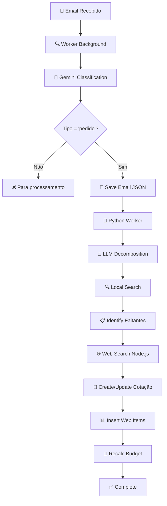
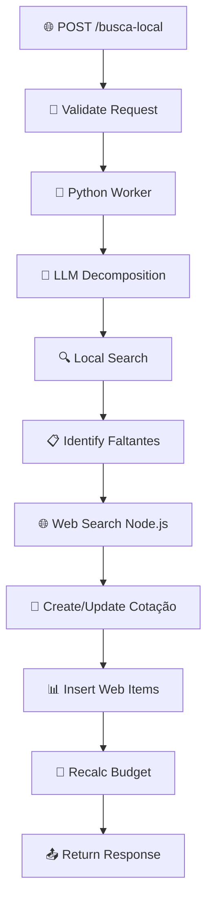

# Fluxo de Busca Local + Busca Automática + Cotação

## Visão Geral do Sistema

O SmartQuote é um sistema híbrido que combina busca local (em base de dados própria) com busca automática na web para gerar cotações completas. O sistema pode ser acionado de duas formas:

1. **Via Email** - Monitoramento automático de emails
2. **Via API HTTP** - Requisições diretas para `/api/busca-local`

## Arquitetura do Sistema

```
┌─────────────────┐    ┌─────────────────┐
│     Email       │    │   HTTP Request  │
│   Monitoring    │    │   /busca-local  │
└─────────┬───────┘    └─────────┬───────┘
          │                      │
          ▼                      ▼
┌─────────────────────────────────────────┐
│          Gemini AI Interpretation       │
│     (Classifica e extrai informações)   │
└─────────────────┬───────────────────────┘
                  │
                  ▼
┌─────────────────────────────────────────┐
│         Python Worker (Persistente)     │
│    • Decomposição LLM (Groq)           │
│    • Busca Local (Weaviate + Supabase) │
│    • Identifica "faltantes"            │
└─────────────────┬───────────────────────┘
                  │
                  ▼
┌─────────────────────────────────────────┐
│       Node.js Orchestrator             │
│    • Busca Web (Firecrawl)             │
│    • Criação/Update de Cotação         │
│    • Inserção de Itens                 │
│    • Cálculo de Orçamento              │
└─────────────────────────────────────────┘
```

---

## Fluxo Detalhado

### 1. **ENTRADA DO SISTEMA**

#### 1.1 Fluxo via Email
```
📧 Email Recebido
     ↓
🔍 Worker de Monitoramento (background)
     ↓
🧠 Gemini AI Analysis
     ↓ (se classificado como "pedido")
📝 Salvamento do Email
     ↓
🐍 Processamento Python
```

#### 1.2 Fluxo via HTTP
```
🌐 POST /api/busca-local
     ↓
📝 Validação da solicitação
     ↓
🐍 Processamento Python (direto)
```

---

### 2. **INTERPRETAÇÃO E CLASSIFICAÇÃO** (Apenas para Emails)

**Responsável**: `GeminiInterpretationService.ts`

**Processo**:
1. **Análise do Email** com Gemini AI
   - Classifica como "pedido" ou "outro"
   - Extrai informações estruturadas
   - Define prioridade e confiança

2. **Decisão de Processamento**
   - ✅ Se "pedido": continua para processamento Python
   - ❌ Se "outro": para aqui (não processa)

**Exemplo de Saída**:
```json
{
  "tipo": "pedido",
  "prioridade": "alta", 
  "solicitacao": "Preciso de uma API KYC-AML para verificação bancária",
  "confianca": 95
}
```

---

### 3. **PROCESSAMENTO PYTHON** (Worker Persistente)

**Responsável**: `scripts/busca_local/main.py`

#### 3.1 Decomposição com LLM (Groq)
- **Input**: Texto da solicitação
- **Output**: JSON estruturado com:
  ```json
  {
    "solucao_principal": "API KYC-AML para verificação bancária",
    "tipo_de_solucao": "produto",
    "itens_a_comprar": [...],
    "alternativas_viaveis": [...],
    "orcamento_estimado_range": {...}
  }
  ```

#### 3.2 Geração de Queries de Busca
- **Principal (Q0)**: Query geral da solução
- **Itens (Q1, Q2, Q3...)**: Queries específicas por item
- **Alternativas (QALT-X)**: Queries para alternativas

#### 3.3 Busca Local Híbrida
**Tecnologias**: Weaviate (vetorial) + Supabase (filtros)

**Processo por Query**:
1. Busca em `vetor_portugues`
2. Busca em `vetor_multilingue` (se habilitado)
3. Agregação por (nome, categoria)
4. Ordenação por score
5. Aplicação de filtros (categoria, palavras-chave)

#### 3.4 Identificação de Faltantes
**Lógica**:
- Se Q0 ou Q1 têm resultados: apenas itens sem resultado são "faltantes"
- Se nem Q0 nem Q1 têm resultados: tudo é "faltante"

**Output Python**:
```json
{
  "status": "success",
  "dados_extraidos": { /* JSON completo do LLM */ },
  "faltantes": [
    {
      "id": "Q1",
      "nome": "API KYC-AML", 
      "categoria": "Software de Conformidade",
      "query_sugerida": "API KYC-AML Software de Conformidade...",
      "quantidade": 1
    }
  ],
  "resultado_resumo": { /* resultados encontrados localmente */ },
  "cotacoes": { /* se Python criou cotação */ }
}
```

---

### 4. **BUSCA AUTOMÁTICA WEB** (Node.js)

**Responsável**: `BuscaAutomatica.ts` + `FornecedorService.ts`

#### 4.1 Preparação
- Busca fornecedores ativos: `getFornecedoresAtivos()`
- Obtém configurações: `getConfiguracoesSistema()`
- Lista de sites para buscar
- Número de resultados por site

#### 4.2 Busca Multi-Site
**Para cada "faltante"**:
```typescript
// Para cada faltante
busca.buscarProdutosMultiplosSites(
  faltante.query_sugerida, 
  sites, 
  numResultadosPorSite
)
```

**Tecnologia**: Firecrawl API
- Scraping inteligente dos sites
- Extração de produtos com:
  - Nome
  - Preço  
  - Descrição
  - URL do produto
  - URL da imagem

#### 4.3 Combinação de Resultados
- Agregação de resultados de todos os sites
- Deduplicação por similaridade
- Ordenação por relevância

---

### 5. **CRIAÇÃO E ATUALIZAÇÃO DA COTAÇÃO**

#### 5.1 Estratégia de Cotação
**Cenário A - Python criou cotação**:
- Usa a cotação existente (`cotacoes.principal_id`)
- Insere itens web na cotação existente

**Cenário B - Python não criou cotação**:
- Node.js cria prompt: `PromptsService.create()`
- Node.js cria cotação: `CotacoesService.create()`
- Insere itens web na nova cotação

#### 5.2 Estrutura da Cotação
```json
{
  "prompt_id": 123,
  "status": "incompleta",
  "aprovacao": false,
  "faltantes": [ /* lista de faltantes */ ],
  "orcamento_geral": 0  // será recalculado
}
```

#### 5.3 Inserção de Itens Web
**Responsável**: `CotacoesItensService.ts`

**Para cada produto web encontrado**:
```typescript
CotacoesItensService.insertWebItem(cotacaoId, produto)
```

**Mapeamento**:
```json
{
  "cotacao_id": 123,
  "origem": "web",
  "provider": "sistec.co.ao",  // extraído da URL
  "external_url": "https://...",
  "item_nome": "Nome do Produto",
  "item_descricao": "Descrição...",
  "item_preco": 150000,  // parseado de string para número
  "item_moeda": "AOA",
  "quantidade": 1
}
```

#### 5.4 Recálculo do Orçamento
**Após inserir todos os itens**:
1. Busca todos os itens da cotação
2. Calcula: `total = Σ(item_preco × quantidade)`
3. Atualiza `orcamento_geral` na cotação

---

## Fluxos Específicos

### Fluxo Email Completo



### Fluxo HTTP Direto



---

## Estruturas de Dados

### Request HTTP
```json
{
  "solicitacao": "Preciso de uma API KYC-AML para verificação bancária",
  "limite": 5,
  "multilingue": true
}
```

### Response HTTP
```json
{
  "success": true,
  "message": "Busca híbrida concluída",
  "dados_python": {
    "dados_extraidos": { /* JSON LLM completo */ },
    "faltantes": [ /* itens não encontrados localmente */ ],
    "resultado_resumo": { /* produtos encontrados localmente */ }
  },
  "resultados_web": [ /* produtos encontrados na web */ ],
  "itens_web_inseridos": 3,
  "cotacao_principal_id": 456
}
```

### Estrutura do Prompt (dados_extraidos)
```json
{
  "solucao_principal": "API KYC-AML para verificação bancária",
  "tipo_de_solucao": "produto",
  "itens_a_comprar": [
    {
      "nome": "API KYC-AML",
      "natureza_componente": "software",
      "prioridade": "critica",
      "categoria": "Software de Conformidade",
      "especificacoes_minimas": {...},
      "quantidade": 1
    }
  ],
  "alternativas_viaveis": [...],
  "orcamento_estimado_range": {
    "minimo": 5000000,
    "maximo": 10000000
  },
  "prazo_implementacao_dias": 30
}
```

---

## Configurações e Dependências

### Variáveis de Ambiente Necessárias
```env
# Supabase
SUPABASE_URL=https://xxx.supabase.co
SUPABASE_SERVICE_ROLE_KEY=xxx

# Gemini AI
GEMINI_API_KEY=xxx
GEMINI_MODEL=gemini-2.0-flash

# Firecrawl (busca web)
FIRECRAWL_API_KEY=xxx

# Groq (Python LLM)
GROQ_API_KEY=xxx

# Email Monitoring
GMAIL_CLIENT_ID=xxx
GMAIL_CLIENT_SECRET=xxx
GMAIL_REFRESH_TOKEN=xxx

# Weaviate
WEAVIATE_URL=http://localhost:8080
```

### Tabelas Database
- `prompts` - Armazena dados extraídos pelo LLM
- `cotacoes` - Cotações principais e alternativas  
- `cotacoes_itens` - Itens individuais das cotações
- `produtos` - Base local de produtos
- `fornecedores` - Sites para busca automática

---

## Características Técnicas

### Performance
- **Python Worker**: Persistente, evita reinicialização
- **Busca Local**: Vetorial + filtros híbridos
- **Busca Web**: Paralela em múltiplos sites
- **Deduplicação**: Evita processamento duplicado de emails

### Escalabilidade
- **Pool de Workers Python**: Configurável (min/max)
- **Timeout**: 120s por tarefa Python
- **Rate Limiting**: Controlado por fornecedor
- **Background Processing**: Não bloqueia interface

### Confiabilidade
- **Lock de Arquivos**: Evita processamento duplicado
- **Fallbacks**: Criação de cotação quando Python falha
- **Error Handling**: Logs detalhados em cada etapa
- **Status Tracking**: Acompanhamento completo do fluxo

---

## Monitoramento e Logs

### Logs de Debug
```
🐍 [PYTHON-LOG] - Processamento Python
🧠 [GEMINI] - Interpretação de emails  
🌐 [BUSCA-WEB] - Busca automática web
💾 [COTACAO] - Operações de cotação
📧 [AUTO-MONITOR] - Monitoramento de emails
```

### Métricas Importantes
- Tempo de processamento Python
- Taxa de sucesso da busca web
- Número de itens encontrados (local vs web)
- Taxa de criação de cotações
- Emails processados vs ignorados

---

Este documento fornece uma visão completa do sistema SmartQuote, desde a entrada até a geração final da cotação, cobrindo todos os componentes e integrações envolvidas no processo.
