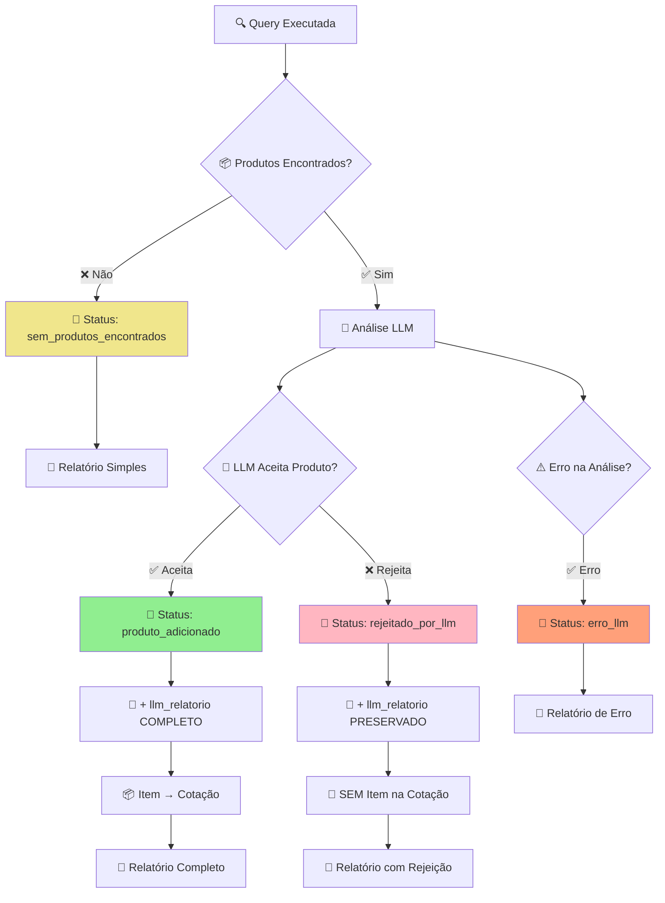

# 🎨 Diagrama Visual - Tabela Relatórios

## 📊 Estrutura Geral

```
📄 TABELA: relatorios
├── 🔑 id (BIGSERIAL)
├── 🔗 cotacao_id (BIGINT) → cotacoes(id)
├── 📋 analise_local (JSONB) ← CAMPO PRINCIPAL
├── 👤 criado_por (TEXT)
├── 📅 criado_em (TIMESTAMP)
└── 🔄 atualizado_em (TIMESTAMP)
```

## 🔍 Detalhamento do Campo `analise_local`

```json
[
  {
    "query_id": "Q1",           // 🎯 Identificador da query
    "score": 0.856,             // 📊 Score da busca (0-1)
    "alternativa": false,       // 🔄 Se é cotação alternativa
    "status": "...",            // 📋 Status do processamento
    "observacao": "...",        // 💬 Observações específicas
    "llm_relatorio": {          // 🧠 Análise completa da LLM
      "top_ranking": [...],     // 🏆 Produtos ranqueados
      "escolha_principal": "...",// ✅ Decisão final
      "justificativa_escolha": "...", // 📝 Motivo da escolha
      "criterios_aplicados": [...],   // 🎯 Critérios usados
      "observacoes": "..."      // 💡 Observações da LLM
    }
  }
]
```

## 🌊 Fluxograma de Processamento



## 📋 Status Possíveis e Cores

| 🎨 Cor | Status | Descrição | Item Cotação | LLM Report |
|--------|--------|-----------|--------------|------------|
| 🟢 | `produto_adicionado` | Produto aceito e inserido | ✅ | ✅ |
| 🔴 | `rejeitado_por_llm` | Produto rejeitado pela LLM | ❌ | ✅ |
| 🟡 | `sem_produtos_encontrados` | Busca sem resultados | ❌ | ❌ |
| 🟠 | `produto_sem_id` | Produto sem ID válido | ❌ | ❌ |
| 🔵 | `produto_duplicado` | Produto já existe | ❌ | ❌ |
| ⚫ | `erro_llm` | Erro na análise LLM | ❌ | ⚠️ |

## 🏗️ Anatomia do LLM Relatório

```json
{
  "llm_relatorio": {
    
    // 🏆 TOP RANKING - Produtos analisados
    "top_ranking": [
      {
        "id": 42,                           // 🔑 ID do produto
        "nome": "Notebook Dell Inspiron",  // 📦 Nome do produto
        "preco": "850000.0",               // 💰 Preço
        "posicao": 1,                      // 🏆 Posição no ranking
        "justificativa": "...",            // 📝 Por que está nesta posição
        "pontos_fortes": [                 // ✅ Vantagens
          "Processador Intel i7",
          "16GB RAM"
        ],
        "pontos_fracos": [                 // ❌ Desvantagens
          "Placa de vídeo integrada"
        ],
        "score_estimado": 0.92             // 📊 Score da LLM (0-1)
      }
    ],
    
    // ✅ DECISÃO FINAL
    "escolha_principal": "Notebook Dell Inspiron (ID: 42)",
    
    // 📝 JUSTIFICATIVA DA ESCOLHA
    "justificativa_escolha": "Produto atende perfeitamente aos requisitos...",
    
    // 🎯 CRITÉRIOS APLICADOS
    "criterios_aplicados": [
      "custo_beneficio: medio",
      "categoria: notebooks",
      "orcamento_maximo: 1000000"
    ],
    
    // 💡 OBSERVAÇÕES GERAIS
    "observacoes": "Produto recomendado para ambiente corporativo"
  }
}
```

## 📊 Distribuição Típica de Status

```
📈 Distribuição Normal em Produção:

🟢 produto_adicionado     ████████████ 60%
🔴 rejeitado_por_llm      ██████       30%
🟡 sem_produtos_encontrados ██         8%
🟠 produto_sem_id         █            1%
🔵 produto_duplicado      █            1%
```

## 🔗 Relacionamentos na Base

```
👥 USUÁRIO
    ↓ cria
📧 EMAIL
    ↓ gera
🔍 INTERPRETAÇÃO
    ↓ processa
📋 PROMPT
    ↓ executa
💰 COTAÇÃO
    ↓ analisa
📊 RELATÓRIOS ← VOCÊ ESTÁ AQUI
    ↓ detalha
📦 COTAÇÃO_ITENS
```

## 🎯 Casos de Uso Visuais

### 1. **✅ Cenário Ideal - Produto Aceito**
```
🔍 Query: "notebook para trabalho"
    ↓
📦 3 produtos encontrados
    ↓
🧠 LLM analisa todos
    ↓
✅ LLM escolhe: "Dell Inspiron"
    ↓
📊 Relatório: produto_adicionado + análise completa
    ↓
💰 Item adicionado à cotação
```

### 2. **❌ Cenário Rejeição - Análise Preservada**
```
🔍 Query: "impressora barata"
    ↓
📦 5 impressoras encontradas
    ↓
🧠 LLM analisa todas
    ↓
❌ LLM rejeita: "Todas muito caras"
    ↓
📊 Relatório: rejeitado_por_llm + análise COMPLETA
    ↓
🚫 Nenhum item na cotação
```

### 3. **🟡 Cenário Vazio - Sem Produtos**
```
🔍 Query: "drone profissional"
    ↓
❌ 0 produtos encontrados
    ↓
📊 Relatório: sem_produtos_encontrados
    ↓
🚫 Nenhum item na cotação
```

## 🔧 Comandos Úteis de Manutenção

### **Limpeza de Relatórios Antigos**
```sql
-- Remover relatórios de cotações antigas (90+ dias)
DELETE FROM relatorios 
WHERE criado_em < NOW() - INTERVAL '90 days';
```

### **Compactação de Dados**
```sql
-- Reindexar após limpeza
REINDEX INDEX idx_relatorios_analise_local;
VACUUM ANALYZE relatorios;
```

### **Backup de Relatórios**
```sql
-- Exportar relatórios para arquivo
\copy (SELECT * FROM relatorios WHERE criado_em >= '2025-01-01') TO 'relatorios_2025.csv' CSV HEADER;
```

---

## 🎉 Benefícios da Nova Estrutura

### 🔍 **Transparência Total**
- Todas as decisões são rastreáveis
- Análises LLM preservadas mesmo em rejeições
- Histórico completo de processamento

### 📊 **Analytics Avançados**
- Métricas de performance da LLM
- Padrões de rejeição identificáveis
- Otimização baseada em dados reais

### 🚀 **Escalabilidade**
- Estrutura JSONB flexível
- Índices otimizados para performance
- Consultas eficientes mesmo com milhões de registros

---

*Diagrama atualizado em: 3 de setembro de 2025*  
*Versão: 2.0 - Estrutura com preservação completa LLM*
